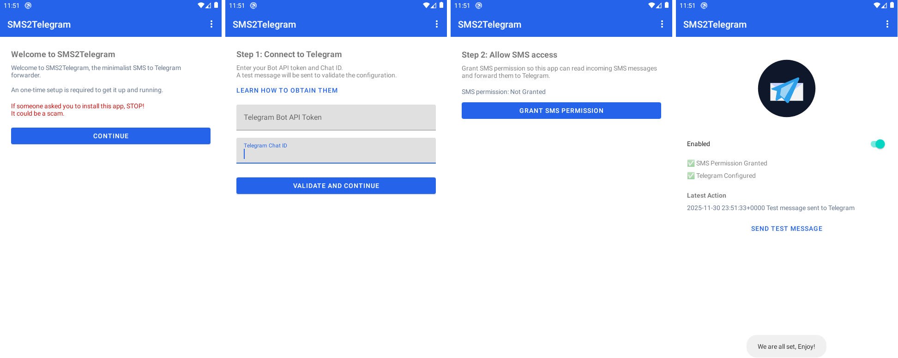

# Minimalist Android SMS to Telegram Forwarder

No Ads, No Pro/Premium, No Tracking, No Unnecessary Permissions.

Free & Open Source under MIT license, built for common good.

Support Android 5.0+ with no dependencies (Not even Play Store).

## Motivation

I use old Android phone to receive OTP from multiple numbers.

Existing apps from Play Store are full of ads, paywalls and some require unnecessary permissions.

Given that SMS OTP are sensitive data and leaking it poses critical security risk.

I decide to make an FOSS Telegram to SMS Forwarder, and share it freely for common good.

Everyone are free to review the code, compile it themselves and use it risk-free.

## How to use

In the next few steps, you will create your own Telegram Bot with official chatbot.

Therefore your data will not be shared with any third party servers.

### Step 1: Create Telegram Bot API Key

Start a chat with [@BotFather](https://t.me/botfather)

You:
> /newbot

BotFather:
> Alright, a new bot. How are we going to call it? Please choose a name for your bot.

You:
> SMS2Telegram

BotFather:
> Good. Now let's choose a username for your bot. It must end in `bot`. Like this, for example: TetrisBot or tetris_bot.

You:
> SMS2TelegramDemoBot

BotFather:
> Done! Congratulations on your new bot. You will find it at t.me/SMS2TelegramDemoBot. You can now add a description, about section and profile picture for your bot, see /help for a list of commands. By the way, when you've finished creating your cool bot, ping our Bot Support if you want a better username for it. Just make sure the bot is fully operational before you do this.

> Use this token to access the HTTP API:
> 8284599999:AAGbDp-Lk1IJFaoH0fuO6skp3rc-XXX_XXX
> Keep your token secure and store it safely, it can be used by anyone to control your bot.

> For a description of the Bot API, see this page: https://core.telegram.org/bots/api

Now we got the API Key: *8284599999:AAGbDp-Lk1IJFaoH0fuO6skp3rc-XXX_XXX*

### Step 2: Obtain your ChatID

From the previous step, click on the link of your new bot: *t.me/SMS2TelegramDemoBot*, and click on the big "START" button.

Replace {TOKENHERE} with the token obtained from last step for the following URL:

https://api.telegram.org/bot{TOKENHERE}/getUpdates

It should look like this:

https://api.telegram.org/bot8284599999:AAGbDp-Lk1IJFaoH0fuO6skp3rc-XXX_XXX/getUpdates

Open it with browser, you will see something like:

> {"ok":true,"result":[{"update_id":217299999,
"message":{"message_id":1,"from":{"id":1417799999,"is_bot":false,"first_name":"My Telegram Username","username":"mytgusername","language_code":"en"},"chat":{"id":1417799999,"first_name":"My Telegram Username","username":"mytgusername","type":"private"},"date":1764271714,"text":"/start","entities":[{"offset":0,"length":6,"type":"bot_command"}]}}]}

Look for the first number after "id".

Now we got the ChatID: *1417799999*

### Step 3: App setup

For example now we have both API Key and ChatID.

API Key: *8284599999:AAGbDp-Lk1IJFaoH0fuO6skp3rc-XXX_XXX*

ChatID: *1417799999*

Copy both value to the app and tap "Send Test Message", you should receive a message from the bot you created.

Do not forget to "Grant SMS Permission".

## Download

Although you are encouraged to build it from source code for maximum security.

You can download the latest APK from the GitHub releases page: [Releases](releases/latest)

Play Store listing (Pending for Approval): [Play Store Link](https://play.google.com/store/apps/details?id=com.tigerworkshop.sms2telegram)

## Build from source

Just clone the project and use the latest version of Android Studio to import it.